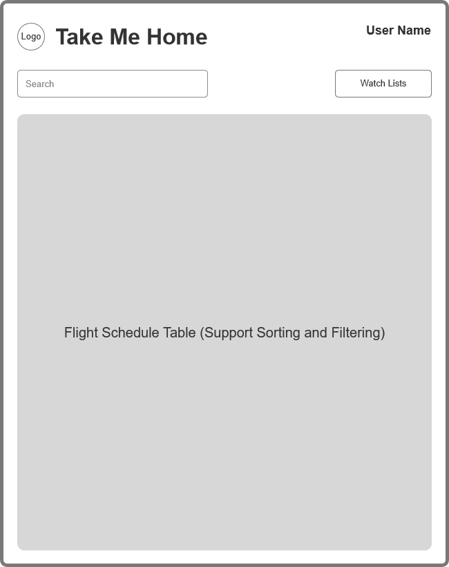
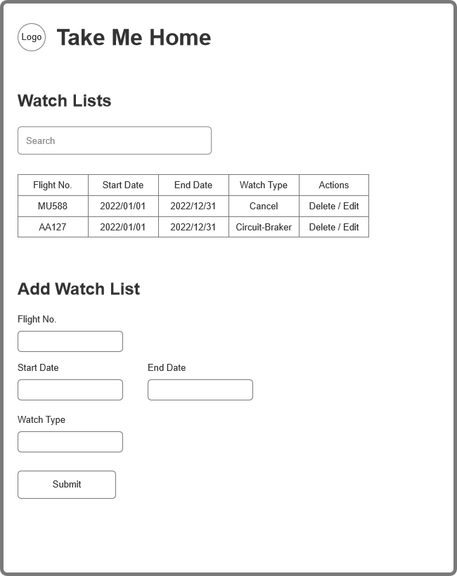
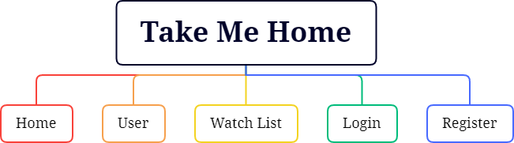

# Take Me Home - CAAC Flight Tracker (US)

## Overview

Flying internationally to China has never been more difficult under the Civil Aviation Administration of China (CAAC)'s "circuit breaker" flight regulations and the Chinese Embassy's testing requirements.

The circuit-breaker rules mandate that all incoming passengers to China must be tested for COVID-19. If 5 or more passengers on the same flight test positive, that flight will be suspended for one week. If 10 or more passengers on one flight test positive, the suspension increases to 4 weeks. The rules apply to all flights into China, and passengers are tested on arrival.

*Take Me Home* is a web app that will provide users with the most up-to-date flight schedules, new international travel policies, and warnings of potential flight cancellations. Users can register and log in. Once they're logged in, they can view and filter available flights. Users can create watch lists based on flight number  and date range. Once a flight in the user's watch list has high cancellation risks, the user will receive notifications via text messages or IOS push.


## Data Model

The application will store `User`, `Country`, `City`, `Airport`, `Airline`, `Schedule`, and `WatchList`

* users can have multiple lists (via references)
* each list can have multiple items (by embedding)

An Example User:

```javascript
{
    username: "Lao Lao",
    password: "PCzEfcjrC4XUdEVNC962" // a password hash
}
```

An Example Country:

```javascript
{
    countryname: "United States"
}
```

An Example City:

```javascript
{
    countryid: "", // a reference to a Country object
    cityname: "New York"
}
```

An Example Airport:

```javascript
{
    cityid: "", // a reference to a City object
    airportcode: "JFK"
}
```

An Example Airline:

```javascript
{
    countryid: "", // a reference to a Country object
    airlinename: "United Airlines"
}
```

An Example Schedule:

```javascript
{
    airlineid: "", // a reference to a Airline object
    flightno: "MU588",
    flightdate: "2022/05/18",
    flightschedule: ".2..5..", // every Tue and Fri
    flightplan: "2022/01/31-2022/05/31",
    depcityid: "", // a reference to a City object
    arrcityid: "", // a reference to a City object
    stopno: 1, // number of stops
    stops: ["South Korea (Technical Stop)"]
}
```

An Example WatchList:

```javascript
{
    userid: "", // a reference to a User object
    flightno: "MU588",
    startdate: "2022/01/01",
    enddate: "2022/12/31",
    watchtype: 0 // 0: watch cancellation, 1: watch circuit-breaker risk
}
```

## [Link to Commented First Draft Schema](db.js) 

## Wireframes

- `/` - index page for showing flight schedules
  - 
- `/user` - page for showing/editing user profile
  - 
- `/watchlist` - page for showing/editing watch lists
  - 

## Site map



## User Stories or Use Cases

1. as non-registered user, I can register a new account with the site
2. as a user, I can log in to the site
3. as a user, I can view/search/sort/filter flight schedules
4. as a user, I can add watch list to receive information on selected flights via text message or IOS push
5. as a user, I can edit/delete existing watch list
6. as a user, I can view/edit my profile

## Research Topics

* (5 points) Integrate user authentication
    * Use `Passport.js` for user authentication
* (5 points) `Vue.js` and `Ant Design Vue`
    * Use `Vue.js` as the frontend framework
    * Use `Ant Design Vue` for UI components
* (5 points) Text Message and IOS Push
    * Use `Bark` for sending push notification to IOS devices
    * Use `Alibaba Cloud SMS` for sending text messages to users


## [Link to Initial Main Project File](app.js)

## Annotations / References Used

1. [Passport.js Authentication Docs](http://passportjs.org/docs)
2. [Tutorial on Vue.js](https://vuejs.org/guide/introduction.html)
3. [Ant Design Vue Docs](https://antdv.com/docs/vue/introduce/)
4. [Bark Github Page](https://github.com/Finb/Bark)
5. [Alibaba Cloud SMS Docs](https://www.alibabacloud.com/help/en/doc-detail/158393.htm)
